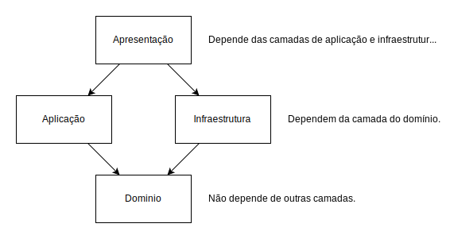

# Design do Software

## Introdução

O projeto será desenvolvido usando DDD (Domain Driven Design), uma abordagem de desenvolvimento de software que visa separar o projeto em camadas, cada uma com sua responsabilidade.

## Camadas

O projeto será dividido em 4 camadas:

### Domínio

Camada que contém as regras de negócio.
Não depende de nenhuma outra camada.

- Entities (Entidades)
- Repository Contracts (Contratos de Repositório)

### Aplicação

Camada que contém a lógica de aplicação.
Depende da camada de domínio.

- Handlers
- Middlewares
- Requests (Requisições)
- Responses (Respostas)
- Validators (Validadores)

### Infraestrutura

Camada que contém a lógica de acesso a dados.
Depende da camada de domínio.

- Database (Banco de Dados)
- Repositories (Repositórios)

### Apresentação (API)

Camada que contém a lógica de apresentação.
- Container de Injeção de Dependência
- Controllers

Depende da camada de aplicação e da camada de infraestrutura.